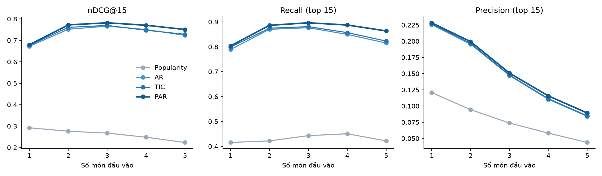

# TIỂU LUẬN MÔN KHAI PHÁ DỮ LIỆU

## HỆ KHUYẾN NGHỊ DỰA TRÊN LUẬT KẾT HỢP THEO CẶP
*(Recommender system based on pairwise association rules)*

| | |
|---|---|
| Bài báo nghiên cứu | Osadchiy, T., Poliakov, I., Olivier, P., Rowland, M., Foster, E. (2019). Recommender system based on pairwise association rules. *Expert Systems with Applications*, 115, 535–542. https://doi.org/10.1016/j.eswa.2018.07.077 |
| Nhóm kỹ thuật | Association Rule Mining |
| Ứng dụng | Recommender Systems using Association Rules |
| Học viên | [CẦN BỔ SUNG: họ tên, MSHV] |
| Lớp, học phần | [CẦN BỔ SUNG: lớp Thạc sĩ CNTT, học phần Khai phá dữ liệu] |
| Giảng viên hướng dẫn | [CẦN BỔ SUNG] |

**Cách đọc các nhãn trong bài.** Thông tin lấy từ bài báo chính hoặc từ bài kiểm chứng đi kèm được ghi kèm nguồn dạng (Osadchiy và cs., 2019). Các đoạn có chữ **[Thực nghiệm của tiểu luận]** là kết quả do chính tiểu luận chạy trên dữ liệu tổng hợp. Các đoạn có chữ **[Nhận xét riêng]** là ý kiến của người viết, không phải kết luận của tác giả bài báo.

---

## Tóm tắt

Collaborative filtering và content-based filtering đều cần dữ liệu về từng người dùng hoặc từng mặt hàng. Khi người dùng chỉ ghé hệ thống vài lần, hoặc dữ liệu quá nhạy cảm để lưu hồ sơ cá nhân, hai cách này không hoạt động tốt vì thiếu dữ liệu để bắt đầu (cold start). Osadchiy và cs. (2019) xử lý vấn đề này cho hệ thống khảo sát khẩu phần ăn Intake24: thay vì học sở thích của từng người, họ học thói quen của cả quần thể từ các bữa ăn đã khai báo, rồi dùng vài món người dùng vừa chọn để gợi ý những món có thể bị bỏ sót.

Bài báo so sánh ba cách cài đặt: luật kết hợp nhiều món ở vế trái (AR), một biến thể của implicit social graph (TIC) và luật kết hợp theo cặp (PAR). Trên 20.000 bữa ăn thật, PAR cho kết quả tốt nhất ở cả đường precision-recall lẫn nDCG, đồng thời nhanh nhất khi sinh gợi ý. So với các câu hỏi gợi ý viết tay của chuyên gia dinh dưỡng, PAR nhận ra 79,1% món bị bỏ sót (ở mức nhóm món cấp hai), trong khi prompt viết tay chỉ nhận ra tối đa 8,3%. Bài kiểm chứng trên hai khảo sát thực tế cho thấy số món được người dùng chấp nhận tăng, nhưng precision chỉ khoảng 2%.

Tiểu luận trình bày lại thuật toán PAR cùng hai thuật toán so sánh, kiểm tra lại các ví dụ số của bài bằng mã cài đặt, và chạy một thực nghiệm nhỏ theo giao thức của bài trên dữ liệu bữa ăn tổng hợp. Dữ liệu Intake24 không công khai nên thực nghiệm này không tái lập được số liệu của bài báo, mà chỉ kiểm tra xem xu hướng chung có xuất hiện hay không.

**Từ khoá:** association rules, recommender system, cold start, pairwise association rules, nDCG, Intake24.

---

## Mục lục

1. Giới thiệu
2. Cơ sở lý thuyết
3. Bài toán của bài báo
4. Ba thuật toán được so sánh
5. Kết quả đánh giá trong bài báo
6. Kiểm chứng trên hai khảo sát thực tế
7. Thực nghiệm trên dữ liệu tổng hợp
8. Thảo luận
9. Kết luận
Tài liệu tham khảo · Phụ lục

---

## 1. Giới thiệu

### 1.1. Vấn đề

Hệ khuyến nghị thường được xây trên hai ý tưởng. Collaborative filtering dựa vào việc những người có hành vi giống nhau thường thích những thứ giống nhau. Content-based filtering dựa vào mô tả của mặt hàng để tìm món tương tự những gì người dùng đã thích (Pazzani và Billsus, 2007). Cả hai cần một lượng dữ liệu nhất định về người dùng. Người dùng mới, tức chưa có lịch sử, rơi vào tình huống gọi là cold start (Lika và cs., 2014).

Trong thực tế có những hệ thống mà tình huống này là bình thường chứ không phải ngoại lệ. Bài báo nêu ví dụ cửa hàng trực tuyến cho khách chưa đăng nhập, gợi ý người nhận email, các ứng dụng đòi hỏi quyền riêng tư cao, và khảo sát khẩu phần ăn, nơi mỗi người chỉ tham gia rất ít lần (Osadchiy và cs., 2019). Bài toán cụ thể của bài là hệ thống Intake24: người tham gia vừa khai báo xong vài món trong một bữa ăn, hệ thống cần nhắc những món đi kèm mà họ hay quên, như bơ trên bánh mì nướng hay sữa trong trà.

### 1.2. Mục tiêu của tiểu luận

1. Nắm cách bài báo biến bài toán gợi ý món bị bỏ sót thành bài toán khai phá luật kết hợp, và vì sao chọn luật theo cặp.
2. Cài đặt lại ba thuật toán của bài (AR, TIC, PAR) và kiểm tra bằng các ví dụ số trong bài.
3. Chạy một thực nghiệm nhỏ theo giao thức của bài để xem PAR có giữ được ưu thế khi dữ liệu thay đổi.

### 1.3. Nguồn tài liệu và phần tự thực hiện

Nội dung về bài báo dựa trên toàn văn bài báo chính (có kèm corrigendum) và bản arXiv của bài kiểm chứng (arXiv:1903.12264); cả hai được lưu trong thư mục `sources/` của repo. Bài báo chính có giấy phép CC BY 4.0. Mọi con số về kết quả của bài báo trong tiểu luận được ghi lại từ hai tài liệu này. Một số kết quả ở dạng đồ thị (đường precision-recall, nDCG) bài không nêu số cụ thể nên tiểu luận chỉ mô tả xu hướng.

Phần tự thực hiện gồm: cài đặt lại thuật toán, tái hiện các bảng ví dụ, và thực nghiệm ở Mục 7. Phần này dùng dữ liệu bữa ăn tổng hợp do chương trình sinh ra, và kết quả không được so sánh trực tiếp với con số trong bài báo.

### 1.4. Bố cục

Mục 2 nhắc lại các khái niệm cần dùng. Mục 3 mô tả bài toán và bối cảnh Intake24. Mục 4 trình bày ba thuật toán. Mục 5 và 6 tóm tắt kết quả của nhóm tác giả. Mục 7 là thực nghiệm của tiểu luận. Mục 8 và 9 là thảo luận và kết luận.

---

## 2. Cơ sở lý thuyết

### 2.1. Collaborative filtering, content-based filtering và cold start

Collaborative filtering tạo gợi ý từ mô hình sở thích dựng bằng dữ liệu người dùng, có thể là điểm đánh giá trực tiếp (rating) hoặc tín hiệu gián tiếp như thời gian xem. Cách này đã được dùng ở quy mô lớn, ví dụ gợi ý sản phẩm trong thương mại điện tử (Linden và cs., 2003). Content-based filtering so khớp thuộc tính của mặt hàng với những gì người dùng từng ưa chuộng. Cả hai bị hạn chế khi dữ liệu thưa hoặc hồ sơ người dùng còn trống.

Các hướng xử lý cold start đã có gồm kết hợp hai họ phương pháp (Schein và cs., 2002), đoán sở thích từ thông tin nhân khẩu học (Lika và cs., 2014) hoặc từ quan hệ xã hội (Carrer-Neto và cs., 2012). Cả ba đều cần thêm một loại thông tin ngoài lịch sử hành vi. Bài báo đang xét quan tâm đến những bối cảnh không có loại thông tin đó (Osadchiy và cs., 2019).

### 2.2. Luật kết hợp

Cho một tập các giao dịch, mỗi giao dịch là một tập mặt hàng. Luật kết hợp có dạng *antecedent ⇒ consequent*: nếu giao dịch chứa các món ở vế trái thì thường chứa món ở vế phải (Agrawal và cs., 1993). Hai độ đo chính:

- **support** của một tập món: tỉ lệ giao dịch chứa tập đó.
- **confidence** của luật X ⇒ Y: tỉ lệ giao dịch chứa X mà cũng chứa Y, nghĩa là xác suất có điều kiện P(Y | X).

Quy trình quen thuộc là tìm các tập món có support đủ lớn rồi sinh luật có confidence đủ lớn. FP-growth là một thuật toán tìm tập phổ biến mà không phải sinh ứng viên, và có bản song song chạy được trên Spark (Li và cs., 2008; Meng và cs., 2016); bài báo dùng bản này cho thuật toán AR.

Bài báo nêu bốn lý do khiến luật kết hợp không dùng ngay được cho khuyến nghị (Osadchiy và cs., 2019): muốn gợi ý đúng từng món (chứ không phải loại món) thì số luật rất lớn; ghép đúng tập món người dùng chọn với vế trái của một luật có thể không ra luật nào; một món có thể xuất hiện ở vế phải của nhiều luật nên cần cách gộp điểm; và ngưỡng support thường đặt cao để danh sách luật ngắn đủ để người đọc xem, trong khi khuyến nghị lại cần cả các luật hiếm. Mục 4 cho thấy mỗi thuật toán xử lý các điểm này thế nào.

### 2.3. Độ đo đánh giá

Với mỗi lượt thử, mô hình trả về một danh sách N món xếp theo điểm, và có một tập món thật sự bị bỏ sót. Các độ đo dùng trong bài:

- **Precision**: số món đoán đúng chia cho số món mô hình trả về.
- **Recall**: số món đoán đúng chia cho số món bị bỏ sót (theo cách tiểu luận cài đặt; bài báo mô tả là phần trăm dự đoán đúng so với tổng số món người dùng chọn).
- **nDCG@N**: độ đo kể đến thứ hạng. Món đúng nằm càng cao trong danh sách thì điểm càng lớn. Công thức DCG = Σ (2^r(i) − 1) / log(i + 1), với r(i) là 1 nếu món ở vị trí i đúng, ngược lại là 0 (Burges và cs., 2005). Bài báo cho rằng IDCG luôn bằng 1 vì chỉ cần một dự đoán đúng ở hạng một; thực nghiệm của tiểu luận dùng cách tính nDCG thông thường (IDCG tính từ số món bị bỏ sót), nên số nDCG không so sánh trực tiếp với bài.

---

## 3. Bài toán của bài báo

### 3.1. Intake24 và việc bỏ sót món

Intake24 là hệ thống để người tham gia tự khai báo những gì đã ăn hôm trước theo phương pháp recall 24 giờ nhiều bước. Người dùng gõ tên món, hệ thống trả về danh sách món tương ứng trong một taxonomy khoảng 4800 món, người dùng chọn một món để thêm vào bữa. Một ngày thường có từ bốn đến bảy bữa (Osadchiy và cs., 2019).

Khi tự khai báo, người dùng hay quên những món đi kèm, như sữa trong cà phê hay bơ trên bánh mì (Osadchiy và cs., 2019, bài kiểm chứng). Với phương pháp phỏng vấn, người phỏng vấn sẽ hỏi lại. Với hệ thống tự điền, phần việc này được làm bằng các câu hỏi gợi ý gọi là associated food prompts: khi người dùng chọn toast, hệ thống hỏi "có bơ không?".

### 3.2. Vấn đề của prompt nhập tay

Mỗi prompt hiện do chuyên gia dinh dưỡng nhập thủ công. Bài báo nêu hai điểm yếu. Thứ nhất, với hàng nghìn món thì không thể nhập đủ, và người nhập dễ bỏ sót. Thứ hai, thói quen ăn uống khác nhau theo vùng, văn hoá, chế độ ăn, nên cần nhập lại khi triển khai ở nơi khác, và phải cập nhật khi có món mới. Theo bài, các prompt hiện có chủ yếu dựa trên kinh nghiệm cá nhân hoặc nghiên cứu trước, chưa có nghiên cứu nào đánh giá mức phù hợp của chúng (Osadchiy và cs., 2019).

### 3.3. Yêu cầu đối với thuật toán

Từ bối cảnh trên, bài đặt ra những ràng buộc cho thuật toán gợi ý. Người trả lời thường chỉ dùng hệ thống trong một đợt khảo sát ngắn, nên không có lịch sử cá nhân. Dữ liệu chỉ cho biết "bữa này có những món nào", không có rating. Thuật toán phải chạy được ngay khi người dùng vừa chọn một hoặc hai món. Vì vậy bài chọn xây mô hình từ các bữa ăn của cả quần thể và coi những gì thuộc về thói quen chung của quần thể là có ích cho một cá nhân trong quần thể đó (Osadchiy và cs., 2019).

---

## 4. Ba thuật toán được so sánh

### 4.1. Ký hiệu và khung chung

Một bữa ăn là tập các món khác nhau, mỗi món chỉ xuất hiện một lần trong bữa. Cả ba thuật toán có cùng hai bước. Bước huấn luyện đọc toàn bộ các bữa ăn để dựng mô hình. Bước gợi ý nhận tập món người dùng đã chọn, ký hiệu **IF** (input foods), và trả về danh sách **RF** gồm các món chưa chọn, mỗi món có một điểm. IF không bao giờ xuất hiện trong RF (Osadchiy và cs., 2019, mục 3.2). Ba thuật toán khác nhau ở loại mô hình lưu lại và cách tính điểm. Để tiện đối chiếu, các ví dụ dưới đây dùng đúng dữ liệu mẫu của bài: bốn bữa ăn {abcd, ade, de, ab} và IF = {a, b}.

### 4.2. AR: luật kết hợp nhiều món ở vế trái

Mô hình là tập các luật có vế trái gồm một hay nhiều món và vế phải là một món, mỗi luật kèm confidence. Khi gợi ý, thuật toán lấy các luật có vế phải chưa thuộc IF và vế trái có chung ít nhất một món với IF. Mỗi luật góp vào điểm của món ở vế phải một lượng bằng confidence nhân với một hệ số **ms** (match score):

> ms = |antecedent ∩ IF|² / (|antecedent| × |IF|)

Hệ số này lớn khi vế trái giống IF, nên luật khớp tốt với những gì người dùng đã chọn được ưu tiên. Điểm của một món là tổng đóng góp của mọi luật dẫn đến nó (Algorithm 1 trong bài). Bài khai phá luật bằng FP-growth trên Spark, với min support và min confidence cùng đặt ở giá trị nhỏ nhất mà việc khai phá vẫn xong trong 5 phút, cụ thể là 3 × 10⁻⁴ sau khi tác giả đính chính (xem mục 5.5).

Trên dữ liệu mẫu, điểm của món d là 2,50, của c là 1,96 và của e là 0,29. Ví dụ, riêng luật {a, b, c} ⇒ d có confidence 1, giao với IF có hai món, vế trái có ba món, nên ms = 4 / (3 × 2) = 2/3, đóng góp 0,67 cho d.

### 4.3. TIC: transactional item confidence

TIC chuyển thể ý tưởng implicit social graph của Roth và cs. (2010), vốn dùng để gợi ý người nhận email. Khác với AR, TIC không lưu luật mà lưu các bữa ăn đã quan sát (mỗi bữa khác nhau chỉ lưu một lần). Với mỗi bữa m và mỗi món f trong m, mô hình lưu xác suất có f khi biết phần còn lại của m, tức số bữa chứa m chia cho số bữa chứa m bỏ f. Khi gợi ý, thuật toán lấy mọi bữa m có giao với IF, và cộng vào điểm của mỗi món f ∉ IF trong m lượng |m ∩ IF| × xác suất của f (Algorithm 2–3).

Trên dữ liệu mẫu, TIC cho d = 3,00, c = 2,00, e = 0,50. Cái giá của TIC là bước huấn luyện: với mỗi bữa duy nhất cần đếm các bữa chứa nó và chứa từng tập con thiếu một món, nên bài đo được thời gian huấn luyện của TIC lớn hơn nhiều so với hai thuật toán còn lại (mục 5.2).

### 4.4. PAR: luật kết hợp theo cặp

PAR chỉ giữ lại thống kê theo cặp. Khi huấn luyện, với mỗi món f, thuật toán đếm **OD[f]** là số bữa có f, và với mỗi cặp món {f, f1} đếm **CD[f, f1]** là số bữa chứa cả hai (Algorithm 4). Không có ngưỡng support hay confidence, và không có bước sinh luật nhiều món. Mô hình chính là hai bảng đếm này.

Khi gợi ý (Algorithm 5), với mỗi món đầu vào `inf` thuộc IF và mỗi món f ≠ `inf` có đi cùng `inf` trong ít nhất một bữa, thuật toán tính:

- p = CD[inf, f] / OD[inf], xác suất f xuất hiện khi đã có `inf`;
- trọng số w = OD[inf], số bữa chứa `inf`.

Với mỗi f, gom hai danh sách P[f] (các p) và W[f] (các w), rồi lấy điểm

> RF[f] = (tổng các p) × (tổng các w)

Tính trên dữ liệu mẫu: OD(a) = 3, OD(b) = 2. Với món d: từ a có p = 2/3, w = 3; từ b có p = 1/2, w = 2. Tổng p = 7/6, tổng w = 5, nên RF[d] = 35/6 ≈ 5,83. Với món c: từ a có p = 1/3, từ b có p = 1/2, tổng p = 5/6, tổng w = 5, RF[c] ≈ 4,17. Với món e: chỉ có a đi cùng, p = 1/3, w = 3, RF[e] = 1. Kết quả khớp với Bảng 3 trong bài (d: 5,8; c: 4,2; e: 1).

Về lý do nhân thêm tổng w, bài giải thích bằng hai ví dụ. Nếu chỉ cộng xác suất thì mất thông tin món được gợi ý đã từng đi cùng bao nhiêu món đầu vào: một món xuất hiện cùng cả C lẫn D nên được ưu tiên hơn món chỉ từng xuất hiện cùng C. Ngoài ra, hai xác suất bằng nhau có độ tin cậy khác nhau nếu một món đầu vào xuất hiện 10 lần còn món kia 100 lần, nên món đầu vào phổ biến hơn được tính nặng hơn (Osadchiy và cs., 2019, mục 3.5).

**[Nhận xét riêng]** Cách gộp này làm điểm chịu ảnh hưởng của độ phổ biến các món đầu vào, bên cạnh độ mạnh của từng quan hệ. Tích hai tổng cũng không còn là xác suất, nên điểm RF chỉ dùng để xếp hạng, không đọc được như một xác suất. Bài không phân tích riêng ảnh hưởng của từng thành phần, nên không biết phần nào trong hai thành phần đóng góp nhiều hơn cho kết quả tốt của PAR.

### 4.5. So sánh ba thuật toán

| | AR | TIC | PAR |
|---|---|---|---|
| Mô hình lưu | Luật nhiều món ở vế trái, kèm confidence | Các bữa duy nhất, kèm xác suất từng món | Hai bảng đếm: OD (từng món), CD (từng cặp) |
| Tham số | min support, min confidence | Không | Không |
| Cách tính điểm | Σ confidence × ms | Σ \|m ∩ IF\| × xác suất | (Σ p) × (Σ w) |
| Khó khăn chính (theo bài) | Số luật rất lớn; có thể không có luật khớp IF | Huấn luyện chậm | Chỉ nhìn được quan hệ giữa từng cặp món |
| Thời gian huấn luyện (bài) | 3905,1 ms | 93710,2 ms | 6904,9 ms |
| Thời gian một lần gợi ý (bài) | 39,5 ms | 32,0 ms | 2,5 ms |

Hai dòng cuối là Bảng 4 của bài (Osadchiy và cs., 2019). **[Nhận xét riêng]** Hạn chế "chỉ nhìn được quan hệ giữa từng cặp" là hệ quả tự nhiên của thiết kế, bài không đo trực tiếp mức mất mát này, nhưng kết quả cho thấy việc giữ luật nhiều món (AR) không đem lại lợi thế trên dữ liệu của bài.

### 4.6. Kiểm tra lại các ví dụ số

Ba thuật toán được cài lại trong `code/paper_algorithms.py`, và `code/verify_paper_examples.py` chạy trên dữ liệu mẫu {abcd, ade, de, ab} với IF = {a, b}. Kết quả khớp các Bảng 1, 2, 3 của bài: AR cho d 2,50, c 1,96, e 0,29; TIC cho d 3,00, c 2,00, e 0,50; PAR cho d 5,83, c 4,17, e 1,00.

Có một điểm không nhất quán trong bài. Pseudocode của TIC (Algorithm 2, dòng 9) tính xác suất bằng c_f / c_m, trong khi lời giải thích bằng chữ và các giá trị ở Bảng 2 ứng với c_m / c_f. Tiểu luận dùng c_m / c_f vì chỉ cách này tái hiện được Bảng 2. Đây là lỗi trình bày trong pseudocode, không ảnh hưởng đến kết luận của bài.

---

## 5. Kết quả đánh giá trong bài báo

### 5.1. Dữ liệu và giao thức

Bài dùng 20.000 bữa ăn lấy ngẫu nhiên, mỗi bữa có ít nhất hai món, do người tham gia ở Anh khai báo trong giai đoạn 2014–2018, thứ tự các món trong bữa được xáo trộn. Mô hình được đánh giá bằng 10-fold cross validation: huấn luyện trên chín phần, thử trên phần còn lại. Với mỗi bữa thử, lấy một số món (từ 1 đến 5) làm đầu vào, các món còn lại, ít nhất một, được coi là món người trả lời bỏ sót. Mỗi mô hình trả về 15 món đầu bảng; tác giả chọn 15 vì lớn hơn một chút số kết quả mà đa số người dùng xem. Các độ đo là đường precision-recall và nDCG@15. Giao thức này lấy theo cách làm của Roth và cs. (2010). Máy chạy thử là Mac Pro 2,9 GHz Intel Core i5, RAM 16 GB (Osadchiy và cs., 2019, mục 4).

### 5.2. So sánh ba thuật toán

Theo bài, PAR cho diện tích dưới đường precision-recall lớn nhất, và diện tích này tăng khi số món đầu vào tăng. PAR cũng có nDCG cao hơn TIC và AR ở mọi cỡ đầu vào. Bài trình bày các kết quả này bằng đồ thị (Hình 1 đến 3) và không nêu số cụ thể. Về thời gian, PAR đứng thứ hai về tốc độ huấn luyện (sau AR) và nhanh nhất khi sinh gợi ý (xem Bảng ở mục 4.5). Dựa trên so sánh này tác giả chọn PAR. Họ cũng nhận xét rằng chất lượng dự đoán của PAR ở bước này vẫn tương đối thấp, và các thí nghiệm sau nhằm cải thiện bằng cách khai thác đặc điểm của bài toán.

### 5.3. So với các prompt viết tay

Để so với prompt viết tay, thuật toán trả về nhóm món (category) thay vì món cụ thể, tận dụng taxonomy của Intake24. Một dự đoán được coi là đúng nếu món người dùng chọn nằm trong nhóm được dự đoán. Do prompt viết tay không có điểm số, bài không vẽ được đường precision-recall hay nDCG cho chúng, nên so sánh recall của 15 gợi ý hàng đầu với recall của toàn bộ prompt viết tay áp dụng cho cùng đầu vào.

Kết quả: prompt viết tay nhận ra tối đa 8,3% món bị bỏ sót. PAR đạt recall tối đa 58,0% khi trả về nhóm cha trực tiếp của món (cấp một, ví dụ "Flake cereals" cho "Choco flakes") và 79,1% khi trả về nhóm rộng hơn một cấp (cấp hai, ví dụ "Breakfast cereals"). Bài cũng lưu ý rằng một số tên nhóm cấp hai quá chung chung, như "Pickles, olives, dips and dressings", có thể khó hiểu với người dùng và cần đặt lại tên. Một lợi ích khác của việc trả về nhóm là xử lý được món mới chưa ai khai báo, vì món đó vẫn thuộc một nhóm đã có dữ liệu (Osadchiy và cs., 2019, mục 5.2).

Bảng 5 trong bài liệt kê những món hay quên mà prompt viết tay hiện chưa phủ nhưng mô hình đoán được, ví dụ khi đầu vào là Cheese sandwich và Tea thì mô hình gợi ý "Crisps and snacks".

### 5.4. Xếp hạng kết quả tìm kiếm

Bài còn dùng PAR cho một việc khác: sắp xếp danh sách món trả về khi người dùng gõ tên món. Cách hiện tại sắp theo số lần món đã được khai báo (FRC), rồi theo chi phí khớp chuỗi. Khi thay FRC bằng điểm của PAR, nDCG cao hơn một chút từ khi có hai món đầu vào trở lên, và khoảng cách rộng dần khi số món đầu vào tăng (Hình 5 của bài).

### 5.5. Về corrigendum

Bài chính in nhầm ngưỡng min support và min confidence của AR thành 3 × 10⁴. Corrigendum (DOI 10.1016/j.eswa.2019.05.022) sửa lại thành 3 × 10⁻⁴ và cho biết lỗi phát sinh khi chuyển file LaTeX sang PDF. Đây là tham số của thuật toán AR, không phải của PAR (PAR không dùng ngưỡng). Điều này cần lưu ý vì tên bài báo dễ khiến người đọc nghĩ ngưỡng áp dụng cho PAR.

---

## 6. Kiểm chứng trên hai khảo sát thực tế

Bài arXiv:1903.12264 của cùng nhóm tác giả đưa PAR vào Intake24 và so sánh với prompt viết tay trên người tham gia thật, tức là chuyển từ đánh giá mô phỏng (ẩn một số món trong dữ liệu cũ) sang đánh giá trên hành vi thật.

### 6.1. Thiết kế

Gợi ý của PAR hiển thị dưới dạng danh sách checkbox ở cuối mỗi bữa, tối đa 15 món. Prompt viết tay vẫn hiện dưới dạng câu hỏi ngay khi người dùng chọn món đầu vào.

- **Khảo sát 1:** 50 người tham gia (một người rút lui giữa chừng), tuổi 18–64, khai báo 5 ngày liên tiếp từ thứ Hai đến thứ Sáu. Một nhóm (n = 19) dùng prompt viết tay trong ba ngày đầu rồi đổi sang prompt sinh tự động; nhóm còn lại (n = 30) làm ngược lại. Dữ liệu thứ Hai bị loại để giảm hiệu ứng làm quen.
- **Khảo sát 2** (trong chiến dịch Newcastle Can về giảm béo phì): 91 người hoàn thành ít nhất một recall, 77 nữ và 14 nam, tuổi 18–82. Một tuần dùng prompt viết tay, một tuần dùng prompt sinh tự động, không có yêu cầu cố định về giờ hay thiết bị.

### 6.2. Kết quả

| | Khảo sát 1 (viết tay / sinh tự động) | Khảo sát 2 (viết tay / sinh tự động) |
|---|---|---|
| Số recall | 96 / 97 | 133 / 119 |
| Recall có ít nhất một món được chấp nhận | 66% / 63% | 50% / 72% |
| Số món chấp nhận trung bình mỗi recall | 1,1 / 2,3 (P < 0,001) | 1,5 / 2,1 (P = 0,002) |
| Precision của prompt | 24% / 2% | 16% / 2% |
| Số món khác nhau được chấp nhận | 15 (9%) / 30 (18%) | 16 (9%) / 35 (19%) |
| Thời gian hoàn thành recall (phút) | 15,9 / 13,3 (P = 0,108) | 15,9 / 16,3 (P = 0,297) |
| Năng lượng báo cáo (kcal) | 1911,8 / 1790,6 (P = 0,159) | 1461,7 / 1545,7 (P = 0,02) |

(Osadchiy và cs., 2019, arXiv:1903.12264. Phần trăm của "số món khác nhau" tính trên số món khác nhau được báo cáo: 164 và 165 ở khảo sát 1, 186 và 189 ở khảo sát 2.)

### 6.3. Các điểm tác giả lưu ý

Precision của prompt sinh tự động chỉ 2% vì danh sách gợi ý dài trong khi chỉ một số ít món hay bị quên. Tác giả dự định đưa tỉ lệ chấp nhận vào mô hình để đưa món dễ bị quên lên cao hơn. Họ cũng nêu các điểm cần thận trọng khi đọc kết quả: hai loại prompt khác cách hiển thị (câu hỏi so với danh sách sau bữa), nên số món chấp nhận nhiều hơn có thể do cách hiển thị chứ không hẳn do gợi ý tốt hơn; mô hình được huấn luyện trên dữ liệu thu lúc đã có prompt viết tay, nên có thể thiếu những quan hệ mà người dùng ít khai báo nếu không bị nhắc; và không có bằng chứng người dùng thật sự đã ăn các món họ chấp nhận. Mặt tích cực họ ghi nhận là hơn một nửa số món mô hình bắt được chưa có trong cơ sở dữ liệu prompt viết tay, nên hai cách có thể bổ sung cho nhau khi triển khai ở một quần thể mới chưa có dữ liệu huấn luyện.

---

## 7. Thực nghiệm trên dữ liệu tổng hợp

**[Thực nghiệm của tiểu luận]**

### 7.1. Mục đích

Dữ liệu Intake24 không công khai, nên không tái lập được số liệu của bài. Thực nghiệm này kiểm tra một câu hỏi hẹp hơn: nếu chạy ba thuật toán theo giao thức của bài trên một tập bữa ăn có cấu trúc kết hợp đã biết trước, PAR có còn đứng đầu hay không, và khác biệt lớn cỡ nào.

### 7.2. Dữ liệu và cách chạy

- **Dữ liệu:** 20.000 bữa ăn do chương trình `code/synthetic_meals.py` sinh ra. Mỗi bữa chọn một trong 12 chủ đề (ví dụ bữa sáng với trà, cá và khoai chiên, cà ri), mỗi món của chủ đề được chọn với xác suất 0,78, sau đó thêm 0–2 món ngẫu nhiên từ nhóm 120 món hiếm. Tổng cộng 175 món, trung bình 5,35 món mỗi bữa, mỗi bữa có ít nhất hai món. Các quan hệ kết hợp ở đây do người viết đặt ra, không phải thói quen ăn uống thật.
- **Giao thức:** theo Mục 5.1: cross validation, lấy 1–5 món làm đầu vào, phần còn lại là món bị bỏ sót, xét 15 gợi ý đầu. Mỗi cỡ đầu vào có 300 lượt thử trong mỗi fold.
- **So với bài báo, khác ở các điểm sau:** dùng 5 fold thay vì 10; AR chỉ khai phá tập món tối đa 4 món (vế trái tối đa 3 món) với ngưỡng 6 giao dịch (tương đương 3 × 10⁻⁴ trên 20.000 bữa) thay vì FP-growth không giới hạn; nDCG tính theo cách thông thường; thêm một baseline xếp theo độ phổ biến để biết mức nền.
- **Các mô hình** dùng đúng công thức ở Mục 4. Mã nằm ở `code/paper_algorithms.py` và `code/run_paper_style_experiment.py`.

### 7.3. Kết quả

**nDCG@15 theo số món đầu vào:**

| Mô hình | 1 | 2 | 3 | 4 | 5 |
|---|---|---|---|---|---|
| Popularity | 0,292 | 0,276 | 0,268 | 0,248 | 0,224 |
| AR | 0,672 | 0,752 | 0,766 | 0,750 | 0,724 |
| TIC | 0,677 | 0,761 | 0,769 | 0,747 | 0,728 |
| **PAR** | **0,680** | **0,772** | **0,782** | **0,771** | **0,751** |

**Recall (top 15) theo số món đầu vào:**

| Mô hình | 1 | 2 | 3 | 4 | 5 |
|---|---|---|---|---|---|
| Popularity | 0,416 | 0,422 | 0,443 | 0,451 | 0,422 |
| AR | 0,789 | 0,870 | 0,877 | 0,850 | 0,815 |
| TIC | 0,799 | 0,875 | 0,881 | 0,857 | 0,823 |
| **PAR** | **0,804** | **0,886** | **0,896** | **0,888** | **0,864** |

Precision (top 15) giảm dần theo số món đầu vào vì số món bị bỏ sót nhỏ đi (PAR: 0,228 ở 1 món đến 0,089 ở 5 món); toàn bộ số nằm trong `results/paper_style_results.csv`.

**So sánh theo cặp.** Vì ba mô hình được thử trên cùng một bộ truy vấn, hiệu nDCG của PAR trừ mô hình khác có thể tính theo từng truy vấn. Gộp mọi cỡ đầu vào (7.500 truy vấn): PAR hơn AR 0,018 (sai số chuẩn 0,0015), hơn TIC 0,014 (sai số chuẩn 0,0013), hơn Popularity 0,489 (sai số chuẩn 0,0037).

**Thời gian** (trung bình trên các fold, máy của môi trường làm việc):

| Mô hình | Huấn luyện (giây) | Một lần gợi ý (ms) |
|---|---|---|
| Popularity | 0,002 | 0,008 |
| AR | 0,545 | 1,325 |
| TIC | 1,283 | 0,259 |
| PAR | 0,024 | 0,020 |

AR ở đây khai phá được 46.266 luật trong fold cuối.

### 7.4. Nhận xét

1. Cả ba thuật toán vượt xa baseline phổ biến, và PAR đứng đầu ở mọi cỡ đầu vào về cả nDCG lẫn recall, giống xu hướng bài báo mô tả. Điều này khớp với kết luận của bài, dù đây chỉ là dữ liệu tổng hợp.
2. Khoảng cách giữa PAR và hai thuật toán còn lại nhỏ: khoảng 0,01–0,02 nDCG. Với sai số chuẩn cỡ 0,0015, chênh lệch này khác không về thống kê, nhưng về mức độ thì nhỏ. Không nên kết luận PAR "tốt hơn rõ rệt" chỉ từ thực nghiệm này.
3. Khi số món đầu vào tăng từ 3 lên 5, chất lượng của cả ba giảm nhẹ. Một lý do có thể là dữ liệu tổng hợp sinh mỗi bữa từ một chủ đề, nên đầu vào càng dài thì phần còn lại để đoán càng ngắn và càng ít món "dễ đoán". Tiểu luận chưa kiểm tra lý do này riêng. Bài báo ghi nhận diện tích dưới đường PR tăng theo số món đầu vào; đó là độ đo khác nDCG nên không so sánh thẳng được, nhưng xu hướng không giống nhau.
4. Về thời gian, không so được với Bảng 4 của bài. Trong bài, PAR huấn luyện chậm hơn AR (6904,9 so với 3905,1 ms), còn ở đây PAR huấn luyện nhanh nhất. Nguyên nhân là cách cài đặt: PAR trong tiểu luận dùng phép nhân ma trận của NumPy, còn AR là đếm tập món bằng Python và bị giới hạn ở 4 món. Điểm duy nhất nhất quán giữa hai nơi là PAR sinh gợi ý nhanh hơn AR và TIC.

### 7.5. Hạn chế

Dữ liệu tổng hợp có cấu trúc sạch và các chủ đề tách nhau rõ, nên không phản ánh độ nhiễu của khẩu phần thật. Chỉ 5 fold và 300 lượt thử mỗi cỡ đầu vào mỗi fold. AR bị cắt ngắn ở 4 món. Không có phân tích độ nhạy với xác suất chọn món (0,78) hay số chủ đề. Vì vậy các con số ở trên chỉ có giá trị minh hoạ cho cách chạy giao thức, không dùng để suy ra hiệu quả trên dữ liệu thật.

---

## 8. Thảo luận

**Điểm mạnh của cách làm.** PAR gần như không có tham số, mô hình chỉ gồm các bảng đếm nên dễ cập nhật khi có bữa ăn mới và dễ chạy lại cho một quần thể khác. Nó không cần lịch sử cá nhân, nên dùng được ngay với người dùng mới. Việc sinh gợi ý nhanh (2,5 ms theo Bảng 4 của bài) cho phép chạy khi người dùng đang nhập.

**Điểm yếu thấy được từ chính bài báo.** Precision thấp (2% trong khảo sát thực tế, bài chính cũng nói chất lượng dự đoán còn "tương đối thấp"). Mô hình chỉ biết quan hệ theo cặp, không biết ngữ cảnh khác như bữa sáng hay bữa tối, hay chế độ ăn của người dùng. Dữ liệu huấn luyện chỉ gồm người tham gia ở Anh, nên chưa biết mô hình chạy thế nào ở nơi có khẩu phần khác; tác giả cũng nêu đây là việc cần nghiên cứu thêm.

**[Nhận xét riêng] Về cách đánh giá.** Giao thức mô phỏng (ẩn một số món rồi đoán lại) cho recall cao, nhưng nó giả định mọi món trong bữa đều có thể bị bỏ sót với xác suất như nhau. Bài kiểm chứng cho thấy thực tế khác: chỉ một số ít món hay bị quên, nên số món được chấp nhận chỉ bằng một phần nhỏ danh sách gợi ý. Vì vậy hai con số 79,1% (mô phỏng) và 2% precision (thực tế) không mâu thuẫn mà đo hai việc khác nhau.

**[Nhận xét riêng] Khi nào nên chọn cách này.** PAR hợp khi dữ liệu là các tập món không có rating, người dùng ít để lại lịch sử, và cần gợi ý nhanh từ vài món vừa chọn. Nếu có lịch sử cá nhân đủ dài thì collaborative filtering có thể gợi ý theo từng người tốt hơn, nhưng tiểu luận không có số liệu nào để so sánh hai hướng này.

**Hướng tiếp theo do tác giả nêu:** đưa tỉ lệ chấp nhận vào mô hình để rút ngắn danh sách; đánh giá ảnh hưởng của đặc điểm ăn uống theo vùng; áp dụng cho các bài toán khác có dạng "người dùng chọn một số mục, cần đoán mục tiếp theo", như gợi ý người nhận email hoặc tag trên các nền tảng cộng đồng (Osadchiy và cs., 2019).

---

## 9. Kết luận

Bài báo của Osadchiy và cs. (2019) đưa ra một cách gợi ý món ăn không cần lịch sử cá nhân. Ý tưởng là đếm số lần từng món và từng cặp món cùng xuất hiện trong các bữa ăn của quần thể, rồi gộp các xác suất có điều kiện theo công thức (Σp) × (Σw). Trong ba cách cài đặt được so sánh (AR, TIC, PAR), PAR cho nDCG cao nhất và sinh gợi ý nhanh nhất trên 20.000 bữa ăn thật. Khi trả về nhóm món, PAR nhận ra tối đa 79,1% món bị bỏ sót, so với 8,3% của các prompt viết tay. Bài kiểm chứng trên hai khảo sát cho thấy người dùng chấp nhận nhiều món hơn với prompt sinh tự động, nhưng precision chỉ 2%, nên cần thêm bước lọc hoặc xếp hạng lại.

Tiểu luận đã cài đặt lại ba thuật toán và tái hiện được các ví dụ số của bài. Thực nghiệm trên dữ liệu bữa ăn tổng hợp cho cùng xu hướng: PAR đứng đầu, nhưng chỉ hơn hai thuật toán còn lại cỡ 0,01–0,02 nDCG. Do dữ liệu là tổng hợp và AR bị giới hạn ở 4 món, kết quả này chỉ để minh hoạ cách chạy giao thức, và không thay thế số liệu trong bài.

Điều đọng lại sau khi làm đề tài này là một mô hình đơn giản, gần như chỉ gồm các bảng đếm, vẫn cạnh tranh được với các cách phức tạp hơn khi dữ liệu là các giỏ món không có rating. Điểm cần cẩn thận là tách rõ độ đo mô phỏng với kết quả trên người dùng thật.

---

## Tài liệu tham khảo

Các tài liệu số 3 đến 12 được trích theo danh mục tham khảo của bài báo chính; tiểu luận không đọc trực tiếp các tài liệu này.

1. Osadchiy, T., Poliakov, I., Olivier, P., Rowland, M., & Foster, E. (2019). Recommender system based on pairwise association rules. *Expert Systems with Applications*, 115, 535–542. https://doi.org/10.1016/j.eswa.2018.07.077
2. Osadchiy, T., Poliakov, I., Olivier, P., Rowland, M., & Foster, E. (2019). Corrigendum to "Recommender system based on pairwise association rules" [Expert Systems with Applications 115 (2018) 535–542]. https://doi.org/10.1016/j.eswa.2019.05.022
3. Osadchiy, T., Poliakov, I., Olivier, P., Rowland, M., & Foster, E. (2019). Validation of a recommender system for prompting omitted foods in online dietary assessment surveys. arXiv:1903.12264.
4. Agrawal, R., Imielinski, T., & Swami, A. (1993). Mining association rules between sets of items in large databases. *Proc. ACM SIGMOD*, 207–216.
5. Roth, M., Ben-David, A., Deutscher, D., et al. (2010). Suggesting friends using the implicit social graph. *Proc. ACM SIGKDD*, 233–242.
6. Linden, G., Smith, B., & York, J. (2003). Amazon.com recommendations: item-to-item collaborative filtering. *IEEE Internet Computing*, 7(1), 76–80.
7. Pazzani, M. J., & Billsus, D. (2007). Content-based recommendation systems. In *The Adaptive Web* (pp. 325–341). Springer.
8. Lika, B., Kolomvatsos, K., & Hadjiefthymiades, S. (2014). Facing the cold start problem in recommender systems. *Expert Systems with Applications*, 41(4), 2065–2073.
9. Schein, A. I., Popescul, A., Ungar, L. H., & Pennock, D. M. (2002). Methods and metrics for cold-start recommendations. *Proc. ACM SIGIR*, 253–260.
10. Carrer-Neto, W., Hernández-Alcaraz, M. L., Valencia-García, R., & García-Sánchez, F. (2012). Social knowledge-based recommender system. Application to the movies domain. *Expert Systems with Applications*, 39(12), 10990–11000.
11. Li, H., Wang, Y., Zhang, D., Zhang, M., & Chang, E. (2008). PFP: parallel FP-growth for query recommendation. *Proc. ACM RecSys*, 107–114. · Meng, X., et al. (2016). MLlib: machine learning in Apache Spark. *Journal of Machine Learning Research*, 17(1), 1235–1241.
12. Burges, C., et al. (2005). Learning to rank using gradient descent. *Proc. ICML*, 89–96.

---

## Phụ lục. Các điểm cần bổ sung và nơi lưu dữ liệu

**Cần bổ sung trước khi nộp:**
- [CẦN BỔ SUNG] Họ tên, MSHV, lớp, giảng viên ở trang bìa.
- [CẦN BỔ SUNG] Quy định trình bày (font, cỡ chữ, định dạng trích dẫn) của giảng viên, nếu khác APA như đang dùng.
- [CẦN BỔ SUNG] Số liệu cụ thể trên Hình 1–5 của bài báo gốc nếu cần; bài chỉ nêu bằng đồ thị.

**Dữ liệu nghiên cứu** nằm trong `research/17-recsys-pairwise-association-rules/`:
- `sources/`: hai file PDF (bài báo kèm corrigendum, bài arXiv) và bản văn bản trích ra;
- `notes/`: nhật ký nguồn, thông tin xuất bản, bối cảnh Intake24, tóm tắt có cấu trúc của bài (`07-paper-digest.md`);
- `code/`: cài đặt AR, TIC, PAR; kiểm tra ví dụ; sinh dữ liệu; thực nghiệm; vẽ hình;
- `results/`: kết quả CSV và JSON, hình, kết quả kiểm tra ví dụ.

Chạy lại: `python3 code/verify_paper_examples.py`, `python3 code/run_paper_style_experiment.py`, `python3 code/make_figures.py` (cần `numpy`, `matplotlib`).
