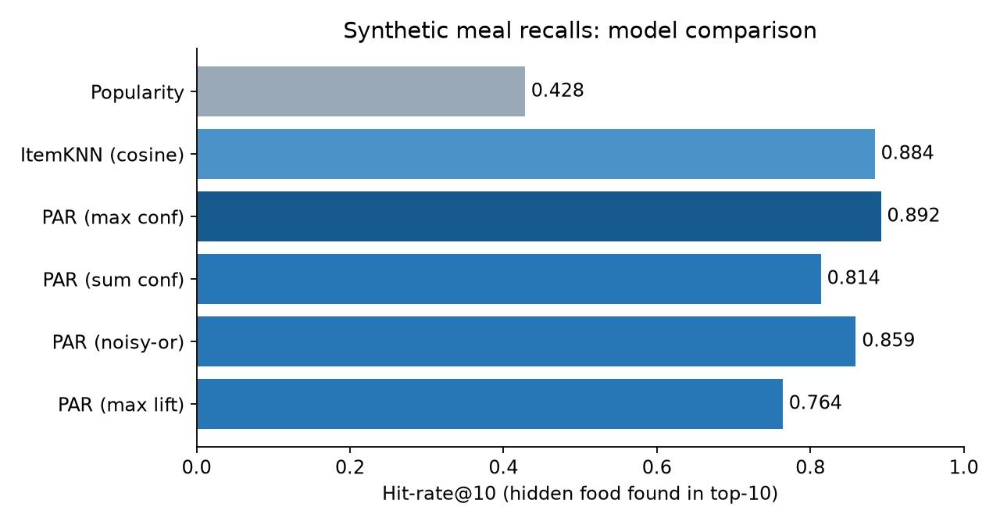
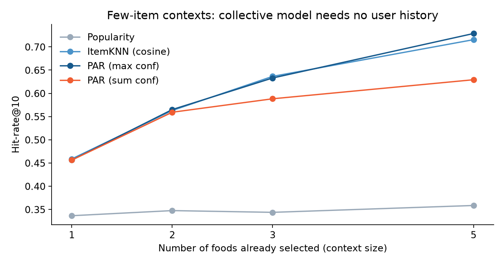
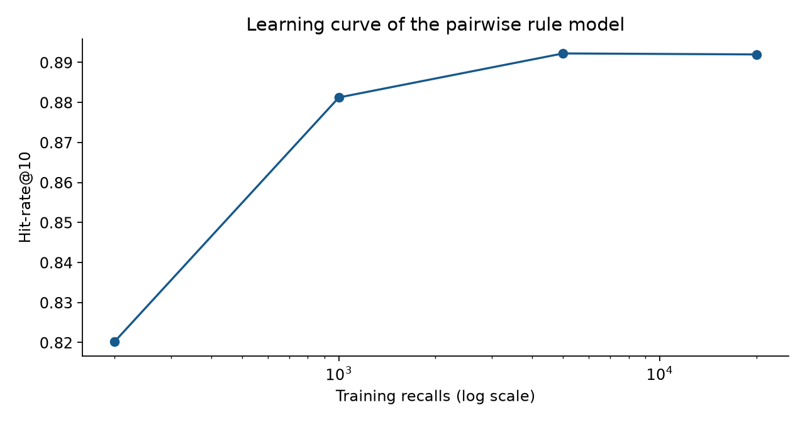

# TIỂU LUẬN MÔN KHAI PHÁ DỮ LIỆU

## HỆ KHUYẾN NGHỊ DỰA TRÊN LUẬT KẾT HỢP THEO CẶP
### (Recommender system based on pairwise association rules)

| | |
|---|---|
| **Bài báo nghiên cứu** | Osadchiy, T., Poliakov, I., Olivier, P., Rowland, M., Foster, E. (2019). *Recommender system based on pairwise association rules.* Expert Systems with Applications, 115, 535–542. doi:10.1016/j.eswa.2018.07.077 |
| **Nhóm kỹ thuật** | Khai phá luật kết hợp (Association Rule Mining) |
| **Ứng dụng** | Hệ khuyến nghị dùng luật kết hợp |
| **Học viên** | …………………………………… (MSHV: ……………) |
| **Lớp / Học phần** | Thạc sĩ Công nghệ thông tin · Khai phá dữ liệu (Data Mining) |
| **Giảng viên hướng dẫn** | …………………………………… |

> **Quy ước nhãn nguồn trong bài.** **[V]** thông tin đã xác minh qua nguồn học thuật tìm được (xem `notes/01-source-log.md`); **[K]** kiến thức giáo khoa chuẩn; **[S]** kết quả thực nghiệm tổng hợp do học viên tự chạy trong thư mục `code/`. Cách gắn nhãn này nhằm tách bạch cái đã kiểm chứng với phần diễn giải.

---

## Tóm tắt

Các hệ khuyến nghị phổ biến như lọc cộng tác và lọc theo nội dung cần hồ sơ người dùng, mô tả mặt hàng và lịch sử sở thích dài. Khi hệ thống được dùng không đều, khi dữ liệu mang tính riêng tư, hoặc khi chỉ có ít chỉ báo về sở thích, các phương pháp này gặp vấn đề **khởi động lạnh (cold start)**. Osadchiy và cộng sự (2019) đề xuất một thuật toán xây dựng **mô hình sở thích tập thể** từ các giao dịch của cả quần thể, dựa trên **luật kết hợp theo cặp**, không cần hồ sơ cá nhân và không cần hệ thống đánh giá (rating) phức tạp; thuật toán được phân tích trên tập giao dịch lớn của hệ thống hồi tưởng khẩu phần ăn Intake24 **[V]**. Một nghiên cứu kiểm chứng đi kèm cho thấy các gợi ý sinh tự động bắt được nhiều món bị quên hơn các gợi ý do chuyên gia dinh dưỡng viết tay, nhưng với độ chính xác thấp hơn đáng kể **[V]**.

Tiểu luận trình bày cơ sở lý thuyết về luật kết hợp và hệ khuyến nghị, phân tích đề xuất của bài báo trong phạm vi thông tin xác minh được, mô hình hoá thuật toán luật theo cặp ở dạng hình thức, và minh hoạ bằng một thực nghiệm trên dữ liệu bữa ăn tổng hợp. Thực nghiệm **[S]** cho thấy mô hình luật theo cặp đạt Hit-rate@10 ≈ 0,89 so với 0,43 của baseline phổ biến nhất, ngang với item-based CF, chỉ cần vài trăm giao dịch để đạt chất lượng gần tối đa, và vẫn hoạt động khi người dùng mới chỉ chọn một món. Tiểu luận cũng nêu rõ các giới hạn: chưa đọc được toàn văn bài báo nên chưa tái lập số liệu gốc, và dữ liệu thực nghiệm là tổng hợp.

**Từ khoá:** luật kết hợp, hệ khuyến nghị, khuyến nghị theo cặp, cold start, sở thích tập thể, Intake24, support, confidence, lift.

---

## Mục lục

1. Giới thiệu
2. Cơ sở lý thuyết
3. Phân tích bài báo
4. Mô hình hoá thuật toán luật kết hợp theo cặp
5. Thực nghiệm minh hoạ
6. Thảo luận
7. Hướng phát triển
8. Kết luận
9. Tài liệu tham khảo
Phụ lục A. Cấu trúc dữ liệu nghiên cứu · Phụ lục B. Các điểm cần đối chiếu với toàn văn

---

## 1. Giới thiệu

### 1.1. Bối cảnh

Hệ khuyến nghị (recommender system) giúp người dùng chọn trong một danh mục rất lớn bằng cách xếp hạng các mặt hàng có khả năng phù hợp. Hai họ phương pháp kinh điển là **lọc cộng tác** (dựa trên hành vi của những người dùng giống nhau) và **lọc theo nội dung** (dựa trên thuộc tính mặt hàng và hồ sơ người dùng) **[K]**. Cả hai đều ngầm giả định có đủ dữ liệu về từng cá nhân.

Giả định này không đúng trong nhiều hệ thống thực tế: người dùng ghé thăm hiếm hoặc không đều, thông tin cá nhân nhạy cảm, hoặc chỉ có rất ít dấu hiệu sở thích. Bài báo trọng tâm xuất phát từ hệ thống **Intake24**, một công cụ hồi tưởng khẩu phần ăn 24 giờ trực tuyến, nơi một người trả lời có thể chỉ tham gia một hai lần nhưng cần được nhắc những món họ dễ bỏ sót **[V]**.

### 1.2. Câu hỏi nghiên cứu

1. Luật kết hợp theo cặp là gì và khác gì so với lọc cộng tác và lọc theo nội dung?
2. Vì sao mô hình sở thích tập thể giúp tránh cold start?
3. Hiệu quả khuyến nghị thể hiện thế nào khi ngữ cảnh rất ngắn (vài món đã chọn) và khi lượng dữ liệu huấn luyện nhỏ?
4. Những giới hạn nào cần lưu ý khi áp dụng?

### 1.3. Phương pháp nghiên cứu và giới hạn nguồn

Học viên (i) tìm kiếm và đối chiếu thông tin về bài báo, công trình đi kèm và nền tảng Intake24; (ii) tổng hợp cơ sở lý thuyết từ các công trình kinh điển; (iii) mô hình hoá thuật toán và (iv) cài đặt một bộ khuyến nghị luật theo cặp để chạy thực nghiệm trên dữ liệu tổng hợp.

**Giới hạn quan trọng.** Môi trường làm việc chỉ truy cập được công cụ tìm kiếm; các trang nhà xuất bản, DOI và arXiv bị chặn. Vì vậy học viên **không đọc được toàn văn** bài báo. Các mô tả về bài báo trong mục 3 dựa trên tóm tắt, highlights và metadata xác minh được; những chi tiết như công thức xếp hạng chính xác, kích thước tập dữ liệu và số liệu kết quả **không** được nêu như thể đã đọc từ bài gốc. Danh sách cần đối chiếu ở Phụ lục B.

### 1.4. Cấu trúc

Mục 2 trình bày lý thuyết; mục 3 phân tích bài báo; mục 4 mô hình hoá thuật toán; mục 5 thực nghiệm; mục 6 thảo luận; mục 7 hướng phát triển; mục 8 kết luận.

---

## 2. Cơ sở lý thuyết

### 2.1. Hệ khuyến nghị

| Họ phương pháp | Dữ liệu cần | Điểm mạnh | Điểm yếu |
|---|---|---|---|
| Lọc cộng tác (user-based) | Ma trận người dùng–mặt hàng, lịch sử cá nhân | Không cần mô tả mặt hàng | Cold start, thưa dữ liệu, quyền riêng tư |
| Lọc cộng tác (item-based) | Quan hệ giữa các mặt hàng từ ma trận người dùng–mặt hàng | Ổn định, tính trước được; dùng ở quy mô lớn (Sarwar và cs. 2001; Linden và cs. 2003) **[V]** | Vẫn cần lịch sử của người dùng hiện tại |
| Lọc theo nội dung | Thuộc tính mặt hàng, hồ sơ người dùng | Khuyến nghị được mặt hàng mới | Cần mô tả giàu, dễ "bong bóng lọc" |
| Luật kết hợp | Giao dịch (giỏ hàng) | Diễn giải được, nhanh, không cần cá nhân hoá | Chỉ dựa trên đồng xuất hiện, thiên lệch phổ biến |

**Cold start** là tình huống thiếu dữ liệu về người dùng hoặc mặt hàng mới (Schein, Popescul, Ungar 2002) **[V]**. Các hướng xử lý gồm kết hợp thông tin nội dung hoặc, như bài báo đang xét, dùng mô hình **tập thể** không phụ thuộc cá nhân.

### 2.2. Khai phá luật kết hợp

Cho tập mặt hàng I và cơ sở dữ liệu giao dịch D = {T₁, …, Tₙ}, Tᵢ ⊆ I. Luật kết hợp có dạng X → Y với X, Y ⊆ I và X ∩ Y = ∅ (Agrawal, Imielinski, Swami 1993) **[V]**.

| Độ đo | Công thức | Diễn giải |
|---|---|---|
| support(X) | \|{T ∈ D : X ⊆ T}\| / n | mức phổ biến của tập X |
| support(X → Y) | support(X ∪ Y) | độ phủ của luật |
| confidence(X → Y) | support(X ∪ Y) / support(X) = P(Y \| X) | xác suất Y xuất hiện khi đã có X |
| lift(X → Y) | confidence(X → Y) / support(Y) | > 1: đi cùng nhau nhiều hơn kỳ vọng ngẫu nhiên (Brin và cs. 1997) **[V]** |
| conviction(X → Y) | (1 − support(Y)) / (1 − confidence) | luật có hướng, đo mức luật "sai" (Brin và cs. 1997) **[V]** |

Quy trình chuẩn gồm hai bước **[K]**: tìm các tập phổ biến có support ≥ minsup, rồi sinh luật có confidence ≥ minconf. Tính **anti-monotone** của support (mọi tập con của tập phổ biến đều phổ biến) cho phép Apriori cắt tỉa ứng viên; FP-growth (Han, Pei, Yin 2000) **[V]** tránh sinh ứng viên bằng cây FP-tree.

### 2.3. Luật kết hợp theo cặp

Luật theo cặp là trường hợp đặc biệt |X| = |Y| = 1, tức a → b **[K]**. Hệ quả:

- **Chỉ cần đếm đồng xuất hiện của từng cặp.** Không cần cơ chế sinh ứng viên nhiều tầng; một lượt duyệt dữ liệu, thời gian cỡ Σ|T|² theo từng giao dịch, bộ nhớ tối đa O(m²) nhưng thực tế thưa.
- **Mô hình là ma trận m × m** (confidence hoặc lift) nên khuyến nghị chỉ cần tra các hàng ứng với món đã chọn.
- **Đánh đổi:** không biểu diễn được tương tác bậc cao (chỉ khi có cả a và b thì c mới xuất hiện).
- Về cấu trúc, gần với **item-to-item CF** vì cùng dựa trên quan hệ mặt hàng–mặt hàng, nhưng luật có hướng và có diễn giải xác suất P(b | a) rõ ràng.

Luật kết hợp đã được dùng cho khuyến nghị từ sớm: Sarwar và cs. (2000) so sánh khai phá luật với lọc cộng tác trong thương mại điện tử **[V]**; Lin, Alvarez, Ruiz (2002) đề xuất khai phá luật với support thích nghi theo từng người dùng **[V]**; các công trình gần đây như RuleRec (Feremans & Goethals) đánh giá quy mô lớn nhiều bộ khuyến nghị theo luật và tổng quát hoá khai phá luật theo cặp bằng chỉ mục đảo **[V]**.

### 2.4. Đánh giá bài toán top-N

Với bài toán xếp hạng top-N, các độ đo sai số như RMSE không phù hợp tự nhiên; nên dùng các độ đo xếp hạng (Cremonesi, Koren, Turrin 2010) **[V]**. Các độ đo thường dùng **[K]**:

- **Hit-rate@N** (hay Recall@N khi ẩn một mặt hàng): tỷ lệ truy vấn có mặt hàng đúng trong N gợi ý đầu.
- **Precision@N** = số gợi ý đúng / N.
- **MRR**: trung bình nghịch đảo thứ hạng của mặt hàng đúng.

Giữa recall và precision có đánh đổi: tăng N tăng recall nhưng giảm precision. Đây chính là điểm mà nghiên cứu kiểm chứng của nhóm tác giả nêu ra: recall cao nhưng precision thấp **[V]**.

---

## 3. Phân tích bài báo

### 3.1. Thông tin chung **[V]**

- **Tiêu đề:** Recommender system based on pairwise association rules.
- **Tác giả:** Timur Osadchiy, Ivan Poliakov, Patrick Olivier, Maisie Rowland, Emma Foster (Newcastle University).
- **Nơi công bố:** Expert Systems with Applications, tập 115, trang 535–542; online năm 2018, số tạp chí năm 2019. DOI 10.1016/j.eswa.2018.07.077.
- **Corrigendum (2019):** bản gốc in nhầm ngưỡng tối thiểu của support và confidence là 3×10⁴; giá trị đúng là **3×10⁻⁴**.

### 3.2. Vấn đề bài báo giải quyết **[V]**

Các hệ khuyến nghị dựa trên lọc cộng tác và lọc theo nội dung phụ thuộc vào hồ sơ người dùng chi tiết, bộ mô tả mặt hàng và lịch sử sở thích dài. Hệ quả là các hệ thống này gặp khó khăn ở ba tình huống:

1. **Cold start** trong hệ thống có mức sử dụng không đều.
2. **Quyền riêng tư**: dữ liệu cá nhân bị hạn chế (dữ liệu ăn uống là loại nhạy cảm).
3. **Chỉ báo sở thích hạn chế**: không có rating phong phú, chỉ có hành vi chọn.

### 3.3. Ý tưởng đề xuất **[V]**

Bài báo đề xuất thuật toán xây dựng **mô hình sở thích tập thể**, độc lập với sở thích cá nhân, dựa trên **luật kết hợp theo cặp** khai thác từ các giao dịch của cả quần thể; thuật toán **không cần hệ thống rating phức tạp**. Các điểm nhấn do chính bài báo nêu: hệ **kháng cold start**; chứng minh ứng dụng cho cả bài toán **khuyến nghị** lẫn bài toán **xếp hạng**.

Diễn giải của học viên: thay vì hỏi "người này thích gì dựa trên lịch sử của họ", hệ thống hỏi "trong những giao dịch có món a, những món nào hay xuất hiện cùng?". Câu trả lời đến từ cả quần thể nên người dùng mới chỉ cần một vài món đã chọn là có khuyến nghị.

### 3.4. Bối cảnh ứng dụng: Intake24

Intake24 là hệ thống hồi tưởng khẩu phần 24 giờ trực tuyến, tự điền, theo quy trình nhiều lượt nhắc (multiple-pass), có hơn 2500 món và hơn 2500 ảnh khẩu phần, và nhiều prompt nhắc món hay quên hoặc hay ăn cùng nhau **[V]**. Một recall là một **giao dịch** (tập món đã ăn trong ngày), nên dữ liệu có sẵn dạng giỏ hàng; không có rating, chỉ có dữ liệu nhị phân ngầm định.

| Đặc điểm Intake24 | Vì sao hợp với luật theo cặp |
|---|---|
| Người dùng đăng nhập không đều | Không dựa lịch sử cá nhân, tránh cold start |
| Dữ liệu là tập món theo từng recall | Khớp mô hình giỏ hàng |
| Không có rating | Chỉ cần dữ liệu nhị phân |
| Dữ liệu ăn uống nhạy cảm | Mô hình tập thể, không cần hồ sơ cá nhân |
| Nhắc món quên dựa trên vài món đã chọn | Khuyến nghị tức thời từ ngữ cảnh ngắn |
| Trước đây prompt do nutritionist viết tay | Tự động hoá và cập nhật theo dữ liệu mới |

### 3.5. Đánh giá trong nghiên cứu của nhóm tác giả

Bài báo phân tích hiệu năng trên một **tập giao dịch lớn** từ hệ thống hồi tưởng khẩu phần thực tế **[V]**. Công trình kiểm chứng đi kèm (arXiv:1903.12264) so sánh các prompt do mô hình sinh với prompt do nutritionist viết tay trong hai nghiên cứu về chế độ ăn, và báo cáo: mô hình **bắt được nhiều món bị quên hơn** prompt viết tay, nhưng **độ chính xác của các prompt sinh ra thấp hơn đáng kể**, cho thấy còn dư địa cải thiện **[V]**.

Học viên không có số liệu định lượng cụ thể từ hai công trình này (không đọc được toàn văn), vì vậy không trích số.

### 3.6. Công trình tiếp nối

- Nhóm tác giả tiếp tục phát triển Intake24 với *progressive 24-hour recall* (JMIR 2020): 33 người tham gia, 65% cho biết nhớ tốt hơn nội dung bữa ăn và khẩu phần khi ghi nhiều lần trong ngày **[V]**.
- Một luận văn tại HCMIU, *Applying Pairwise Association Rules for Recommendation*, tìm cách làm bộ khuyến nghị luật theo cặp hiệu quả hơn bằng cách **xếp hạng lại** gợi ý với rating của mặt hàng **[V]**.

### 3.7. Đóng góp và ý nghĩa

| Khía cạnh | Nhận xét |
|---|---|
| Khoa học | Chứng minh tính khả dụng của luật theo cặp như một mô hình sở thích tập thể trên dữ liệu giao dịch thực quy mô lớn |
| Kỹ thuật | Mô hình đơn giản, diễn giải được, huấn luyện nhanh, tra cứu tức thì |
| Ứng dụng | Thay thế prompt viết tay trong khảo sát dinh dưỡng; tổng quát được cho các hệ thống dùng không đều hoặc nhạy cảm về quyền riêng tư |

---

## 4. Mô hình hoá thuật toán luật kết hợp theo cặp

> Mục này là mô hình hoá **của học viên** dựa trên khái niệm luật theo cặp. Hàm xếp hạng cụ thể của bài báo gốc chưa được đối chiếu (Phụ lục B).

### 4.1. Ký hiệu

- D = {T₁, …, Tₙ}: n giao dịch; mỗi giao dịch là tập con của I, |I| = m.
- cnt(a): số giao dịch chứa a; co(a, b): số giao dịch chứa cả a và b.
- support(a, b) = co(a, b) / n; confidence(a → b) = co(a, b) / cnt(a); lift(a → b) = confidence(a → b) / (cnt(b) / n).

### 4.2. Giai đoạn huấn luyện (xây mô hình tập thể)

```
Đầu vào: D, minsup, minconf
1. Duyệt D một lần; với mỗi giao dịch T và mỗi cặp {a, b} ⊆ T: co(a,b) += 1; với mỗi a ∈ T: cnt(a) += 1
2. Với mọi cặp có co > 0, sinh hai luật a → b và b → a
3. Giữ luật nếu support ≥ minsup và confidence ≥ minconf
Đầu ra: ma trận luật thưa R[a][b] = confidence (và lift)
```

Độ phức tạp thời gian ≈ Σ|T|² [K]; bộ nhớ tối đa O(m²). Theo corrigendum của bài báo, ngưỡng tối thiểu của support và confidence là 3×10⁻⁴ **[V]**.

### 4.3. Giai đoạn suy luận (khuyến nghị)

Cho ngữ cảnh C (tập món đã chọn), điểm của mặt hàng b ∉ C được tổng hợp từ các luật a → b với a ∈ C. Các hàm tổng hợp ứng viên:

| Hàm | Công thức | Ý tưởng |
|---|---|---|
| max | s(b) = max_{a ∈ C} conf(a → b) | bằng chứng mạnh nhất từ một món |
| sum | s(b) = Σ_{a ∈ C} conf(a → b) | cộng dồn bằng chứng |
| noisy-or | s(b) = 1 − Π_{a ∈ C} (1 − conf(a → b)) | xác suất ít nhất một món "kích hoạt" b |
| max-lift | s(b) = max_{a ∈ C} lift(a → b) | giảm thiên lệch phổ biến |

Khuyến nghị là k mặt hàng có điểm cao nhất; hoà điểm xử lý theo độ phổ biến. Ngữ cảnh rỗng thì dùng độ phổ biến (baseline). Độ phức tạp mỗi truy vấn O(|C| · m).

### 4.4. Ví dụ tay (có thể kiểm tra)

Sáu bữa ăn: T₁ = {tea, milk, toast, butter}, T₂ = {tea, milk, biscuit}, T₃ = {coffee, toast, butter, jam}, T₄ = {tea, toast, butter}, T₅ = {coffee, milk, biscuit}, T₆ = {tea, milk, toast}. Số lần xuất hiện: tea 4, milk 4, toast 4, butter 3, biscuit 2, coffee 2, jam 1. Với minsup = 2/6 và minconf = 0,5, các luật giữ lại (xem `results/worked_example.txt`):

| Luật | support | confidence | lift |
|---|---|---|---|
| butter → toast | 0,500 | 1,000 | 1,500 |
| biscuit → milk | 0,333 | 1,000 | 1,500 |
| toast → butter | 0,500 | 0,750 | 1,500 |
| tea → toast | 0,500 | 0,750 | 1,125 |
| tea → milk | 0,500 | 0,750 | 1,125 |
| milk → tea | 0,500 | 0,750 | 1,125 |
| toast → tea | 0,500 | 0,750 | 1,125 |

Với ngữ cảnh C = {tea, toast}: các ứng viên là **butter** và **milk**, cùng điểm max-confidence 0,75. Hoà điểm này thể hiện hạn chế của confidence đơn thuần; dùng lift để phân xử thì butter (lift 1,5 của toast → butter) đứng trên milk (lift 1,125), phù hợp trực giác "trà và bánh mì nướng thường đi với bơ". Đây cũng là lý do thực tế để cân nhắc lift hoặc xếp hạng lại.

### 4.5. So sánh khái niệm với item-based CF

| Tiêu chí | Luật theo cặp | Item-based CF (cosine) |
|---|---|---|
| Quan hệ | Có hướng, P(b \| a) | Đối xứng, cosine |
| Diễn giải | Xác suất, kèm support, lift | Độ tương tự, khó diễn giải |
| Lọc nhiễu | Ngưỡng support, confidence | Thường cắt k láng giềng |
| Dữ liệu | Giao dịch nhị phân | Ma trận người dùng–mặt hàng |

---

## 5. Thực nghiệm minh hoạ **[S]**

### 5.1. Mục đích và giới hạn

Dữ liệu Intake24 dùng trong bài báo không công khai, vì vậy học viên **không tái lập** số liệu của bài. Thực nghiệm dưới đây dùng **dữ liệu bữa ăn tổng hợp** để kiểm tra các tính chất cơ chế mà bài báo nêu: (i) mô hình tập thể có khuyến nghị tốt hay không; (ii) có hoạt động với ngữ cảnh rất ngắn không; (iii) cần bao nhiêu dữ liệu huấn luyện; (iv) ngưỡng ảnh hưởng ra sao. Kết quả phản ánh dữ liệu tự sinh, **không** suy ra trực tiếp cho dữ liệu thật.

### 5.2. Dữ liệu và giao thức

- **Sinh dữ liệu** (`code/synthetic_data.py`): 12 "chủ đề bữa ăn" (bữa sáng trà, ngũ cốc, sáng kiểu Anh, bánh sandwich, salad, súp, mì, thịt quay, cà ri, cá và khoai chiên, tráng miệng, ăn vặt), mỗi recall gồm 2–4 bữa, mỗi món trong chủ đề xuất hiện với xác suất 0,72, cộng thêm các món "đuôi dài" ngẫu nhiên. Tổng cộng 175 món.
- **Quy mô:** 20.000 recall huấn luyện, 4.000 truy vấn kiểm thử; trung bình 11,8 món mỗi recall, mật độ 6,7%.
- **Giao thức** mô phỏng bài toán "món bị quên": ẩn **một** món của recall kiểm thử, dùng các món còn lại làm ngữ cảnh, xếp hạng toàn bộ danh mục, kiểm tra món ẩn có nằm trong top-N không.
- **Độ đo:** Hit-rate@N (= Recall@N khi ẩn một món), Precision@N, MRR. Sai số chuẩn của Hit-rate với 4.000 truy vấn ≈ 0,005, nên chênh lệch dưới ~0,01 không có ý nghĩa.
- **Mô hình so sánh:** Popularity (xếp theo độ phổ biến), ItemKNN (cosine, item-based CF), và bốn biến thể luật theo cặp (max, sum, noisy-or, max-lift) với minsup = minconf = 3×10⁻⁴.

### 5.3. Kết quả

**Bảng 1. So sánh mô hình (toàn bộ ngữ cảnh).**

| Mô hình | Hit-rate@5 | Hit-rate@10 | Precision@10 | MRR@10 |
|---|---|---|---|---|
| Popularity | 0,288 | 0,428 | 0,043 | 0,177 |
| ItemKNN (cosine) | 0,784 | 0,884 | 0,088 | 0,492 |
| **PAR (max confidence)** | **0,825** | **0,892** | **0,089** | **0,497** |
| PAR (noisy-or) | 0,691 | 0,859 | 0,086 | 0,439 |
| PAR (sum confidence) | 0,587 | 0,814 | 0,081 | 0,382 |
| PAR (max lift) | 0,635 | 0,764 | 0,076 | 0,389 |



Nhận xét: mọi biến thể luật theo cặp vượt xa Popularity; PAR (max confidence) và ItemKNN **ngang nhau về thống kê** (0,892 so với 0,884, trong phạm vi sai số). Hàm tổng hợp **max** vượt rõ sum, noisy-or và max-lift trên dữ liệu này.

**Bảng 2. Ảnh hưởng độ dài ngữ cảnh (Hit-rate@10) — tình huống giống cold start.**

| Số món đã chọn | Popularity | ItemKNN | PAR (max) | PAR (sum) |
|---|---|---|---|---|
| 1 | 0,337 | 0,459 | 0,456 | 0,456 |
| 2 | 0,348 | 0,563 | 0,565 | 0,559 |
| 3 | 0,344 | 0,637 | 0,633 | 0,588 |
| 5 | 0,359 | 0,716 | 0,729 | 0,629 |



Chỉ với **một món** đã chọn, mô hình luật theo cặp đã cải thiện khoảng 35% tương đối so với Popularity (0,456 so với 0,337) mà **không dùng bất kỳ thông tin cá nhân nào**. Điều này phù hợp với tính chất "kháng cold start" của mô hình tập thể mà bài báo nêu **[V]**; hit-rate tăng đều khi ngữ cảnh dài hơn.

**Bảng 3. Kích thước tập huấn luyện (PAR max, Hit-rate@10).**

| Số recall huấn luyện | Số luật giữ lại | Hit-rate@10 | MRR@10 |
|---|---|---|---|
| 200 | 5.878 | 0,820 | 0,402 |
| 1.000 | 10.920 | 0,881 | 0,457 |
| 5.000 | 14.092 | 0,892 | 0,495 |
| 20.000 | 15.000 | 0,892 | 0,497 |



Mô hình đạt phần lớn chất lượng chỉ với vài trăm đến một nghìn giao dịch.

**Bảng 4. Ngưỡng support = confidence (PAR max, Hit-rate@10).**

| Ngưỡng | Số luật | Hit-rate@10 |
|---|---|---|
| 3×10⁻⁴ | 15.000 | 0,892 |
| 1×10⁻³ | 7.954 | 0,892 |
| 3×10⁻³ | 4.410 | 0,893 |
| 1×10⁻² | 3.084 | 0,893 |
| 3×10⁻² | 1.252 | 0,893 |

Tăng ngưỡng giảm 12 lần số luật mà chất lượng gần như không đổi: phần lớn luật bị loại là luật nhiễu. Đây là lợi ích thực tế của ngưỡng support, giúp mô hình nhỏ gọn và dễ kiểm duyệt. Lưu ý đây là đặc điểm của dữ liệu tổng hợp có cấu trúc rõ.

**Kiểm tra mô hình có tìm đúng cấu trúc.** Các luật có lift cao nhất (`results/top_rules_by_lift.csv`) là fish ↔ chips (lift 8,5), bread_butter ↔ mushy_peas (8,5), mushy_peas → fish (8,4): đúng chủ đề "fish_chips" đã cài vào dữ liệu, nghĩa là bộ khai phá khôi phục được các quan hệ kết hợp có thật.

### 5.4. Thảo luận kết quả thực nghiệm

1. **Cơ chế hoạt động như kỳ vọng** trên dữ liệu có cấu trúc kết hợp: luật theo cặp vượt xa Popularity.
2. **Ngang item-based CF:** vì cả hai cùng dựa quan hệ mặt hàng–mặt hàng, việc ngang nhau không bất ngờ. Ưu thế của luật theo cặp nằm ở khả năng diễn giải (support, confidence, lift cho từng gợi ý) và ở việc có thể lọc, kiểm duyệt từng luật.
3. **Hàm tổng hợp ảnh hưởng đáng kể:** max tốt hơn sum trên dữ liệu này. Giả thuyết: khi ngữ cảnh gồm món của nhiều bữa khác nhau, tổng confidence dồn điểm cho các món phổ biến liên kết yếu với nhiều chủ đề; max giữ tín hiệu mạnh nhất. Giả thuyết này chưa được kiểm định riêng, và kết luận có thể khác trên dữ liệu thật.
4. **Độ chính xác (precision) thấp ở mức tuyệt đối:** Precision@10 ≈ 0,09 vì mỗi truy vấn chỉ có **một** mặt hàng đúng trong 10 gợi ý. Điều này cũng nhất quán với hiện tượng recall tốt nhưng precision thấp ở nghiên cứu kiểm chứng của nhóm tác giả **[V]**; ở bài toán "nhắc món quên", đánh đổi này có thể chấp nhận được vì người dùng chỉ cần bỏ qua gợi ý không đúng.

---

## 6. Thảo luận

### 6.1. Ưu điểm của khuyến nghị bằng luật theo cặp

| Ưu điểm | Giải thích |
|---|---|
| Kháng cold start | Mô hình tập thể, không cần hồ sơ cá nhân **[V]** |
| Bảo vệ quyền riêng tư | Không cần lưu lịch sử từng cá nhân khi suy luận; mô hình chỉ gồm thống kê tổng hợp |
| Không cần rating | Dùng dữ liệu "đã chọn" nhị phân **[V]** |
| Diễn giải được | Mỗi gợi ý kèm luật với support, confidence, lift; chuyên gia kiểm tra và loại luật không hợp lý |
| Nhanh | Huấn luyện một lượt đếm cặp; suy luận O(\|C\|·m) |
| Dễ cập nhật | Cộng dồn đếm khi có giao dịch mới |

### 6.2. Hạn chế

| Hạn chế | Phân tích |
|---|---|
| Độ chính xác thấp | Nghiên cứu kiểm chứng ghi nhận precision thấp đáng kể **[V]**; thực nghiệm minh hoạ cũng cho Precision@10 thấp [S] |
| Không bắt tương tác bậc cao | Luật a, b → c không biểu diễn được bằng luật đơn |
| Thiên lệch phổ biến | Món phổ biến xuất hiện trong nhiều luật; cần lift hoặc xếp hạng lại |
| Không cá nhân hoá | Mọi người có cùng ngữ cảnh nhận cùng gợi ý; bỏ qua sở thích, chế độ ăn, văn hoá |
| Phụ thuộc phân phối quần thể | Nếu quần thể huấn luyện khác quần thể áp dụng, gợi ý lệch (ví dụ khác vùng miền) |
| Bỏ qua thứ tự và số lượng | Chỉ xét có hay không có món, không xét thứ tự hay khẩu phần |
| Ngưỡng cần chỉnh | Quá thấp sinh nhiều luật nhiễu; quá cao mất món hiếm |
| Quyền riêng tư không tuyệt đối | Luật hiếm có thể làm lộ giao dịch của cá nhân nếu support quá thấp |

### 6.3. So sánh với các hướng khác

- **Lọc cộng tác user-based:** cá nhân hoá tốt khi có lịch sử, nhưng cold start nặng và nhạy cảm quyền riêng tư.
- **Item-based CF:** tương đương về mặt hiệu quả ở thực nghiệm, ít diễn giải hơn.
- **Lọc theo nội dung:** cần thuộc tính mặt hàng; với món ăn có thể dùng thành phần dinh dưỡng, nhưng không bắt được thói quen ăn kèm.
- **Mô hình học sâu và chuỗi:** mạnh hơn khi có dữ liệu rất lớn và hành vi cá nhân, nhưng khó diễn giải và đòi hỏi tài nguyên.

### 6.4. Khả năng áp dụng ngoài dinh dưỡng

Luật theo cặp phù hợp khi dữ liệu là giao dịch và cần khuyến nghị nhanh từ ngữ cảnh ngắn: bán lẻ (mua kèm), thư viện (sách mượn cùng), học trực tuyến (khoá học chọn cùng), khảo sát y tế, tìm kiếm gợi ý tiếp theo. Những nơi ít dữ liệu cá nhân hoặc nhạy cảm là nơi mô hình tập thể phát huy.

### 6.5. Khía cạnh đạo đức

Gợi ý dinh dưỡng có thể ảnh hưởng hành vi; mô hình tập thể tái tạo thói quen phổ biến, kể cả thói quen không lành mạnh. Với ứng dụng sức khoẻ, nên có bước kiểm duyệt chuyên môn đối với luật được dùng, và nên theo dõi thiên lệch giữa các nhóm dân cư.

---

## 7. Hướng phát triển

1. **Xếp hạng lại (re-ranking)** bằng rating hoặc thuộc tính để tăng precision, giống hướng của luận văn HCMIU **[V]**.
2. **Luật bậc cao có chọn lọc** (|X| ≥ 2) cho các cặp dễ nhầm, kết hợp Apriori hoặc FP-growth.
3. **Điều kiện hoá theo ngữ cảnh** (bữa sáng, trưa, tối; loại ngày) để giảm thiên lệch.
4. **Cá nhân hoá nhẹ:** kết hợp mô hình tập thể làm tiên nghiệm với lịch sử cá nhân khi có.
5. **Đánh giá trực tuyến (A/B)** thay vì chỉ ngoại tuyến, đo cả gánh nặng cho người dùng.
6. **Bảo vệ riêng tư chặt hơn** như ngưỡng support tối thiểu theo chính sách hoặc nhiễu vi phân (differential privacy) khi công bố luật.
7. **So sánh định lượng** với các bộ khuyến nghị theo luật hiện đại như RuleRec **[V]**.

---

## 8. Kết luận

Luật kết hợp theo cặp cung cấp một cách xây mô hình sở thích **tập thể** đơn giản, nhanh và diễn giải được: chỉ cần đếm đồng xuất hiện của từng cặp mặt hàng trong các giao dịch của quần thể, rồi tra cứu theo ngữ cảnh ngắn của người dùng. Theo Osadchiy và cộng sự (2019), cách tiếp cận này **kháng cold start**, không cần rating phức tạp và được phân tích trên tập giao dịch lớn của Intake24 **[V]**; nghiên cứu kiểm chứng đi kèm cho thấy nó bắt được nhiều món bị quên hơn prompt viết tay nhưng với độ chính xác thấp hơn đáng kể **[V]**.

Thực nghiệm minh hoạ của học viên trên dữ liệu bữa ăn tổng hợp cho thấy: Hit-rate@10 đạt 0,89 so với 0,43 của baseline phổ biến, ngang item-based CF, hoạt động khi chỉ có một món trong ngữ cảnh, và chỉ cần vài trăm đến một nghìn giao dịch để đạt gần mức tối đa **[S]**. Tuy vậy, kết quả này không thay thế số liệu của bài báo gốc, và cần đối chiếu toàn văn (Phụ lục B) để hoàn thiện phần phân tích thuật toán.

Bài học chính cho học viên: (i) luật theo cặp là điểm cân bằng tốt giữa độ đơn giản và hiệu quả khi dữ liệu là giao dịch; (ii) chọn hàm tổng hợp điểm và dùng lift hoặc xếp hạng lại quan trọng không kém việc khai phá luật; (iii) cần đánh giá cả recall lẫn precision vì hai độ đo này đánh đổi nhau.

---

## 9. Tài liệu tham khảo

1. Osadchiy, T., Poliakov, I., Olivier, P., Rowland, M., Foster, E. (2019). Recommender system based on pairwise association rules. *Expert Systems with Applications*, 115, 535–542. https://doi.org/10.1016/j.eswa.2018.07.077
2. Osadchiy, T., Poliakov, I., Olivier, P., Rowland, M., Foster, E. (2019). Corrigendum to "Recommender system based on pairwise association rules" [Expert Systems with Applications 115 (2018) 535–542]. *Expert Systems with Applications*.
3. Osadchiy, T., Poliakov, I., Olivier, P., Rowland, M., Foster, E. (2019). Validation of a recommender system for prompting omitted foods in online dietary assessment surveys. arXiv:1903.12264.
4. Osadchiy, T., Poliakov, I., Olivier, P., Rowland, M., Foster, E. (2020). Progressive 24-hour recall: usability study of short retention intervals in web-based dietary assessment surveys. *Journal of Medical Internet Research*, 22(2), e13266.
5. Rowland, M. K., Adamson, A. J., Poliakov, I., Bradley, J., Simpson, E., Olivier, P., Foster, E. (2018). Field testing of the use of Intake24, an online 24-hour dietary recall system. *Nutrients*.
6. Agrawal, R., Imielinski, T., Swami, A. (1993). Mining association rules between sets of items in large databases. *Proc. ACM SIGMOD*, 207–216.
7. Agrawal, R., Srikant, R. (1994). Fast algorithms for mining association rules. *Proc. VLDB*.
8. Brin, S., Motwani, R., Ullman, J. D., Tsur, S. (1997). Dynamic itemset counting and implication rules for market basket data. *Proc. ACM SIGMOD*.
9. Han, J., Pei, J., Yin, Y. (2000). Mining frequent patterns without candidate generation. *Proc. ACM SIGMOD*.
10. Sarwar, B., Karypis, G., Konstan, J., Riedl, J. (2000). Analysis of recommendation algorithms for e-commerce. *Proc. ACM Conference on Electronic Commerce*.
11. Sarwar, B., Karypis, G., Konstan, J., Riedl, J. (2001). Item-based collaborative filtering recommendation algorithms. *Proc. WWW10*, 285–295.
12. Linden, G., Smith, B., York, J. (2003). Amazon.com recommendations: item-to-item collaborative filtering. *IEEE Internet Computing*, 7(1), 76–80.
13. Lin, W., Alvarez, S. A., Ruiz, C. (2002). Efficient adaptive-support association rule mining for recommender systems. *Data Mining and Knowledge Discovery*, 6(1), 83–105.
14. Schein, A. I., Popescul, A., Ungar, L. H. (2002). Methods and metrics for cold-start recommendations. *Proc. ACM SIGIR*, 253–260.
15. Cremonesi, P., Koren, Y., Turrin, R. (2010). Performance of recommender algorithms on top-N recommendation tasks. *Proc. ACM RecSys*, 39–46.
16. Feremans, L., Goethals, B. Scalable evaluation of rule-based recommender systems: algorithms and benchmarks (RuleRec). Springer (chương sách).
17. Luận văn HCMIU. Applying pairwise association rules for recommendation. https://keep.hcmiu.edu.vn/handle/123456789/4563

---

## Phụ lục A. Cấu trúc dữ liệu nghiên cứu

Toàn bộ dữ liệu nghiên cứu nằm trong `research/17-recsys-pairwise-association-rules/`:

- `notes/01-source-log.md` nhật ký nguồn, nêu rõ cái gì không xác minh được;
- `notes/02…06` metadata, bối cảnh Intake24, lý thuyết, công trình liên quan, danh sách đối chiếu;
- `code/` cài đặt PAR, dữ liệu tổng hợp, thực nghiệm, biểu đồ, ví dụ tay;
- `results/` bảng CSV, biểu đồ PNG, danh sách luật hàng đầu, ví dụ tay.

Chạy lại: `python3 code/run_experiment.py && python3 code/make_figures.py` (cần `numpy`, `matplotlib`).

## Phụ lục B. Các điểm cần đối chiếu với toàn văn

Hàm xếp hạng chính xác khi ngữ cảnh có nhiều món; vai trò của lift hoặc conviction; kích thước dữ liệu Intake24 và giao thức đánh giá; thuật toán so sánh và số liệu; "ranking task" cụ thể; phân tích độ phức tạp; hạn chế do tác giả nêu; số liệu trong bài arXiv 1903.12264. Chi tiết trong `notes/06-open-questions-checklist.md`.
